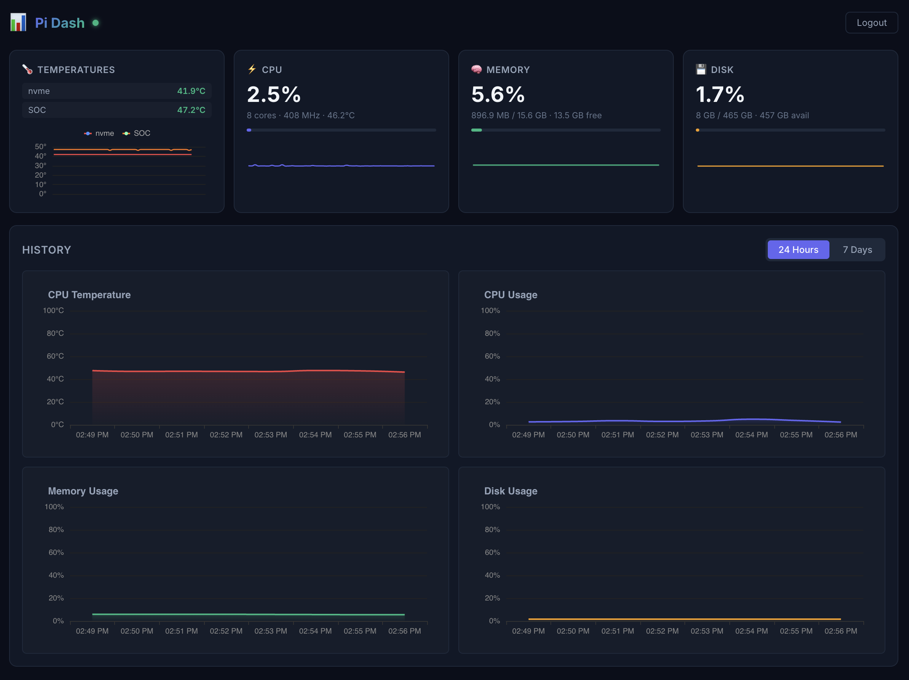

# Pi Dash

Real-time server monitoring dashboard for Raspberry Pi, Orange Pi, and other SBCs.





## Features

- **Live monitoring** — CPU, Memory, Disk, Temperature streamed via WebSocket (1s updates)
- **All temperature sensors** — Scans `/sys/class/hwmon/` for complete coverage
- **History charts** — 24-hour and 7-day views with automatic aggregation
- **Compact dark UI** — Mobile-responsive dashboard with ECharts
- **Single binary** — Rust backend serves React frontend on one port
- **Docker ready** — Multi-platform image (amd64 + arm64)

## Quick Start (Docker)

```bash
docker run -d \
  --name pi-dash \
  --privileged \
  -v pi-dash-data:/data \
  -v /sys:/sys:ro \
  -v /proc:/proc:ro \
  -p 3300:3300 \
  -e PI_DASH_USER=admin \
  -e PI_DASH_PASS=changeme \
  ghcr.io/openhoangnc/pi-dash:latest
```

Then open `http://<your-pi-ip>:3300`

## Docker Compose

```yaml
services:
  pi-dash:
    image: ghcr.io/openhoangnc/pi-dash:latest
    container_name: pi-dash
    ports:
      - "3300:3300"
    environment:
      - PI_DASH_USER=admin
      - PI_DASH_PASS=changeme
      - PI_DASH_PORT=3300
    restart: unless-stopped
    privileged: true
    volumes:
      - pi-dash-data:/data
      - /sys:/sys:ro
      - /proc:/proc:ro

volumes:
  pi-dash-data:
```

## Configuration

| Variable | Default | Description |
|---|---|---|
| `PI_DASH_USER` | `admin` | Login username |
| `PI_DASH_PASS` | `admin` | Login password |
| `PI_DASH_PORT` | `3300` | Server port |

## Development

### Backend (Rust)

```bash
cd backend
PI_DASH_USER=admin PI_DASH_PASS=test cargo run
```

### Frontend (React)

```bash
cd frontend
npm install
npm run dev     # Dev server with proxy to backend
npm run build   # Production build
```

### Build Docker

```bash
docker build -t pi-dash .
```

## Architecture

```
Browser ←→ Actix-Web (single port)
             ├── Static files (React SPA)
             ├── WebSocket /ws (real-time stats)
             ├── REST /api/history (aggregated data)
             ├── REST /api/login (auth)
             └── Background collector (1s interval)
                  ├── sysinfo (CPU, Memory, Disk)
                  ├── /sys/class/hwmon/* (temperatures)
                  └── History store (raw → 1min → 15min)
```

## Stats Monitored

- **CPU**: Usage %, frequency, core count, temperature
- **Memory**: Usage %, available %, total, free
- **Disk**: Usage %, used, available, total
- **Temperature**: All sensors from `/sys/class/hwmon/`

## License

MIT
